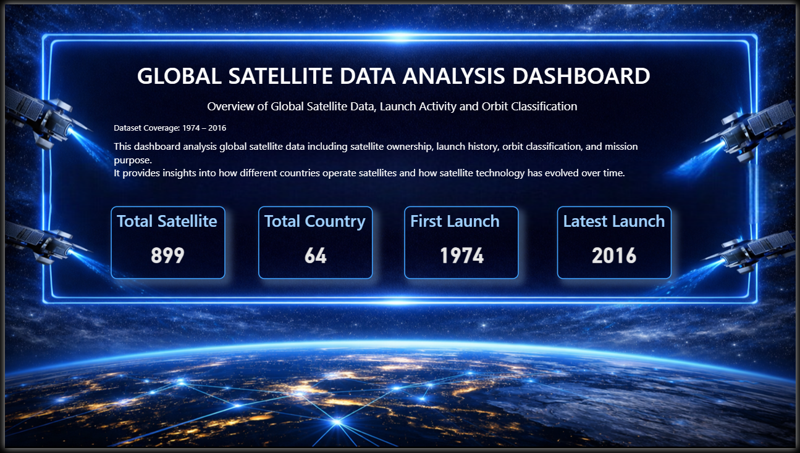
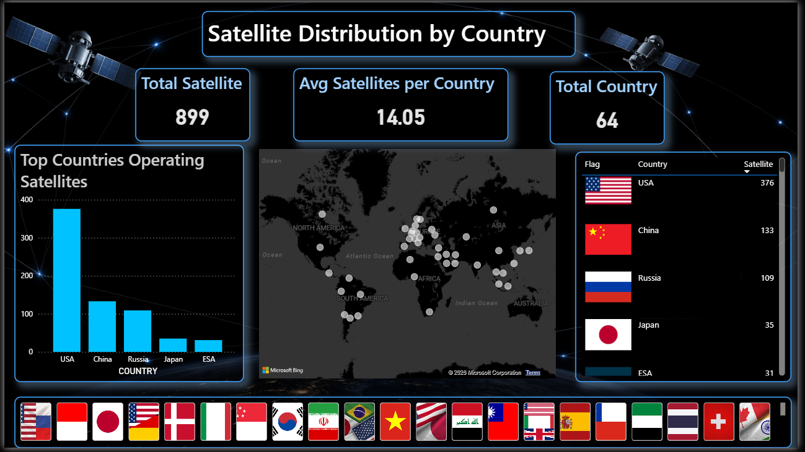
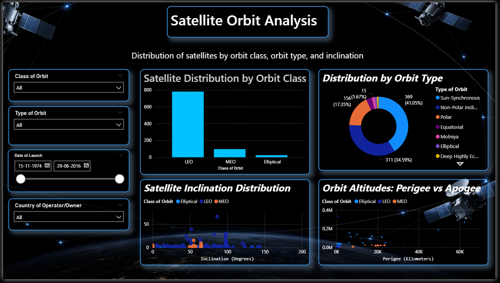
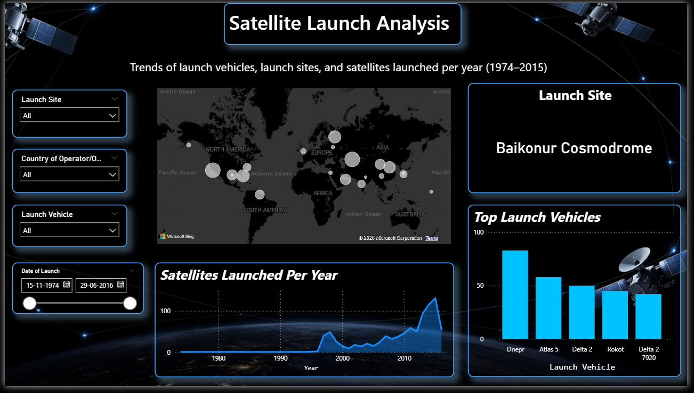
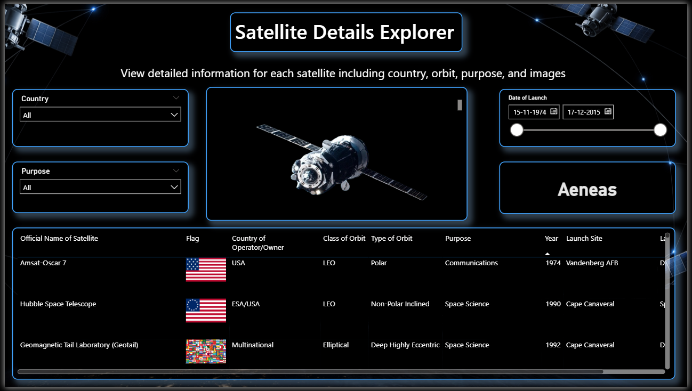

<<<<<<< HEAD
# 🛰 Global Satellite Data Analysis Dashboard  
### 🚀 Power BI | Data Visualization | Analytics Project  

<p align="center">
  🌍 Exploring Satellite Data from <b>1974 – 2016</b> | Turning Data into Insights
</p>

---

## 📊 Project Overview  

This project showcases a **multi-page interactive Power BI dashboard** designed to analyze global satellite data.  
It transforms raw data into **actionable insights** using modern visualization techniques.

🔍 The dashboard helps understand:
- 🌍 Global satellite distribution  
- 🛰 Orbit classification & behavior  
- 🚀 Launch trends and vehicles  
- 📋 Detailed satellite-level exploration  

---

## 🎯 Project Objectives  

✔ Analyze satellite distribution across countries  
✔ Understand orbit classifications (LEO, MEO, GEO, etc.)  
✔ Identify launch patterns over time  
✔ Enable deep exploration of satellite data  
✔ Build a visually appealing and interactive dashboard  

---

## 🧭 Dashboard Navigation  

### 🔹 1️⃣ Overview
📊 Key Metrics:
- 🛰 **Total Satellites:** 899  
- 🌍 **Total Countries:** 64  
- 📅 **First Launch:** 1974  
- 🚀 **Latest Launch:** 2016  

📌 *Provides a high-level summary of the dataset*

---

### 🌍 2️⃣ Country Analysis
- 🗺 Global satellite distribution map  
- 🏳 Country flags with satellite counts  
- 📊 Top countries operating satellites  
- 🎛 Interactive slicers  

📌 **Insight:**  
➡️ USA leads satellite operations, followed by China & Russia  

---

### 🛰 3️⃣ Orbit Analysis
- 📊 Distribution by orbit class (LEO, MEO, Elliptical)  
- 🔄 Orbit type breakdown (Polar, Sun-Synchronous, etc.)  
- 📈 Inclination distribution  
- ⚖ Perigee vs Apogee comparison  

📌 **Insight:**  
➡️ **LEO dominates satellite usage**

---

### 🚀 4️⃣ Launch Analysis
- 📈 Satellites launched per year  
- 🚀 Top launch vehicles  
- 📍 Launch site insights  
- 🌍 Global launch map  

📌 **Insight:**  
➡️ Rapid growth in satellite launches after **2000**

---

### 🔍 5️⃣ Satellite Details Explorer
- 📋 Detailed satellite table  
- 🌍 Country, orbit, purpose, launch data  
- 🖼 Satellite image preview  
- 🎛 Interactive filtering  

📌 *Enables deep, record-level exploration*

---

## 🛠 Tech Stack  

| Tool | Purpose |
|------|--------|
| 📊 Power BI | Dashboard Development |
| 🧠 DAX | Calculations & Measures |
| 📁 Data Modeling | Data Structuring |
| 📈 Visualization | Insights & Storytelling |

---

## 📁 Project Structure (Satellite Mission Control)

```
🛰 Satellite-Dashboard/
│
├── 📊 Global_Satellite_Data_Dashboard.pbix     # Main Power BI dashboard file
│
├── 📁 dataset/                                 # Raw data source
│   └── 📄 satellite_dataset.xlsx                # Satellite dataset (1974–2016)
│
├── 📁 images/                                  # Dashboard screenshots
│   ├── 🌍 overview.png                         # Overview page
│   ├── 🗺 country_analysis.png                # Country analysis page
│   ├── 🛰 orbit_analysis.png                  # Orbit insights
│   ├── 🚀 launch_analysis.png                 # Launch trends
│   ├── 🔍 satellite_details.png               # Detailed explorer
│
└── 📘 README.md                                # Project documentation
```

---

## 📸 Dashboard Preview  

### 🌍 Overview  


### 🗺 Country Analysis  


### 🛰 Orbit Analysis  


### 🚀 Launch Analysis  


### 🔍 Satellite Details  


---

## 🚀 How to Use  

1️⃣ Download the `.pbix` file  
2️⃣ Open in **Power BI Desktop**  
3️⃣ Explore different dashboard pages  
4️⃣ Use filters & slicers for insights  

---

## 💡 Key Insights  

✨ USA dominates global satellite operations  
✨ Launch activity surged after 2000  
✨ LEO is the most utilized orbit  
✨ Baikonur is a major launch site  
✨ Satellites serve communication, navigation & science  

---

## 🌟 Key Features  

✔ Multi-page dashboard design  
✔ Interactive slicers & filters  
✔ Real-world dataset analysis  
✔ Advanced visuals (maps, scatter, donut charts)  
✔ Clean and consistent **space-themed UI**  

---

## 👨‍💻 Author  

**Devkumar Rajole**  
🎯 Data Analyst | Data Science Enthusiast  

🔗 **LinkedIn:** www.linkedin.com/in/devkumar-rajole

  


---

## 📬 Feedback  

💬 I’d love to hear your feedback and suggestions!  

---

## ⭐ Support  

If you like this project:  
👉 Give it a ⭐ on GitHub  
👉 Share it with others  
👉 Connect with me  

---

<p align="center">
🚀 Turning Data into Insights | Building Future-Ready Projects
</p>
=======
# Satellite_data_analysis_dashboard
>>>>>>> a0a022c61afab29ebe79eac562c4791f113da79d
